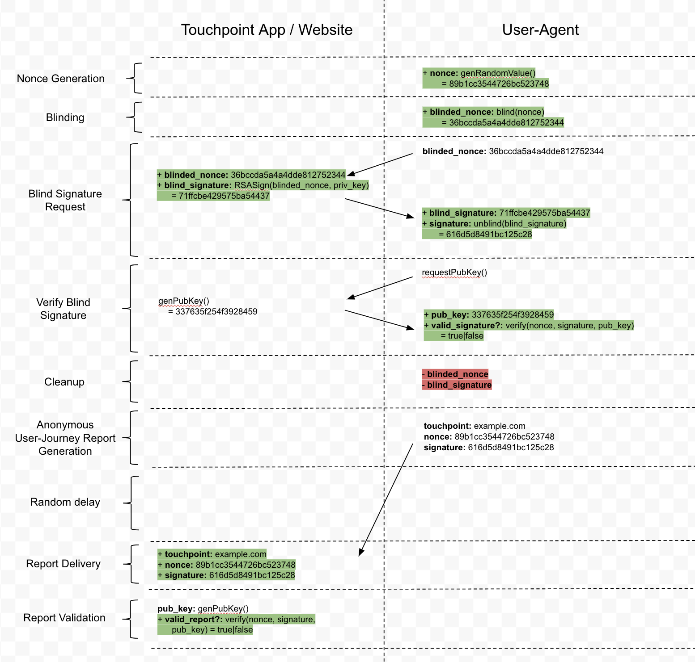
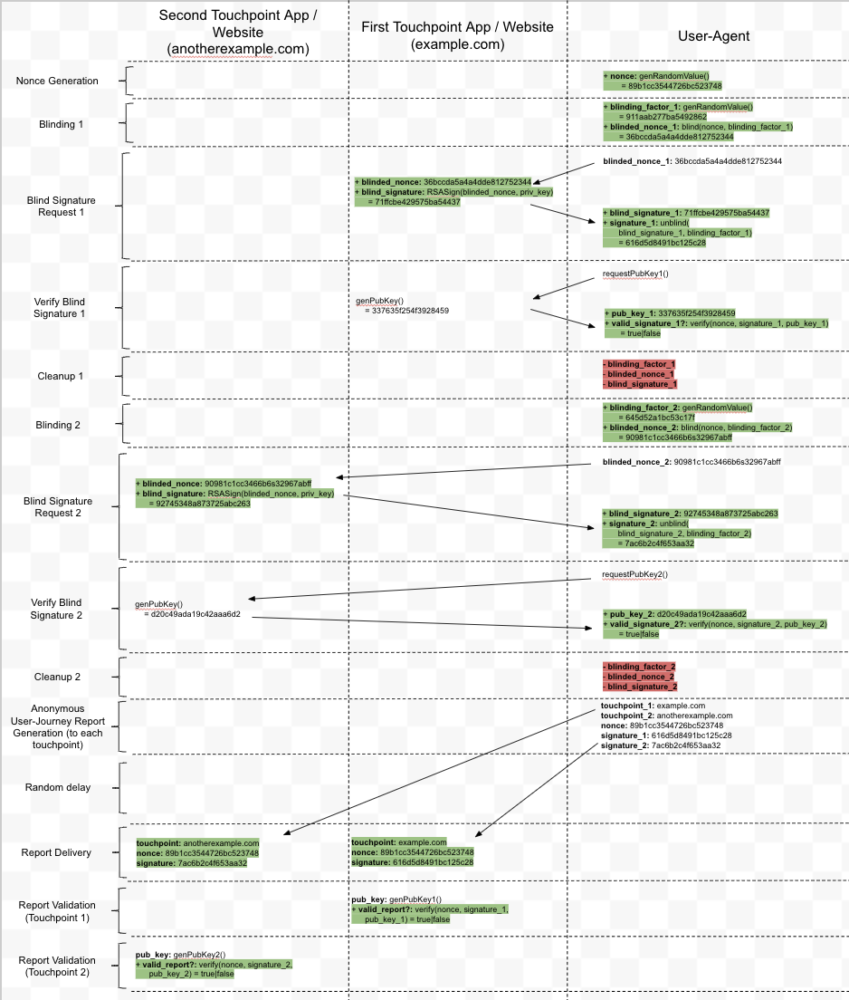

# Fraud Resistant, Privacy Preserving Technology Using Blind Signatures

### Installation Instructions

If you wish to install this demo and test it yourself, please see the [installation instructions](doc/README.md) for additional guidance. Please note that this is **only a demo** and **should not be considered secure**.

### Detailed Technical Information

For those wishing for more technical detail, please also see [supplemental technical documentation](doc/Fraud-Detection-in-Cross-Domain-Reporting-from-a-Browser.md) with more specific information about the threat model and privacy guarantees.

# Overview

One of the areas we’re increasingly focused on at Facebook is how we can design our products and services in ways that preserve privacy while limiting misuse of our platform. A key function we need to preserve during this process is detection and prevention of fraud in measurement of events. Events are actions taken by users off-Facebook (e.g. clicks), but typically reported by a 3rd party to ensure adequate measurement or analytics. Fraud occurs when a non-authentic entity tries to report an event as a legitimate event.

People frequently use our products on a range of surfaces, including our own apps, other apps, and a variety of websites (that are browsed with a variety of browsers). As we evaluate privacy preserving approaches to measurement and analytics across such complex usage patterns, we found that those approaches also bring the risk of fraud. How can we verify that events coming from one of these surfaces is authentic, and not fabricated? Can we do so in a way that only answers the authenticity question without providing any additional information with the event? Below is a proposed solution to this problem that we want to pose to the academic community for input and feedback.

# How to Combat Fraud

The best way to combat fraud is to make it difficult. If fraud is no longer a financially profitable endeavor, then fraudsters lose the financial motivation to pursue it. In general, fraud mitigation involves several steps:

* The first step towards making fraud difficult is to ensure that only legitimate user accounts can generate data (i.e. ensure scripts running on servers cannot generate valid data). This pushes fraudsters to create a handful of legitimate accounts, and then use them to generate a large amount of fraudulent behavior.
* The second step is to limit the amount of fraudulent data that a single user can generate. This forces fraudsters to either create large numbers of accounts or to try to compromise the accounts of large numbers of people.
* The third step is to do a good job detecting and eliminating fake accounts. The specifics of this are out of scope for this post, but for the moment let’s assume that we have good solutions to this problem. So this just leaves fraudsters with the option of compromising large numbers of real accounts.

If an attacker attempts to compromise a real person’s account, they might be able to steal their cookies, or execute rogue code, but it’s unlikely that they will be able to modify that user’s browser or operating system. If we were able to collaborate with browser vendors and operating systems to run a protocol outside of the reach of normal application code, to prove that actions are from legitimate users, this would make life harder for fraudsters. Currently, browsers send user cookies and other signals, which are used to prove that actions came from legitimate users; however we’d like to propose a method to prove that actions came from legitimate users without knowing who the user is.

In this proposal, we propose a protocol that accomplishes the following security and privacy goals:

1. We can detect fabricated events from non-legitimate users and prevent them.
2. We can prove that, for an event, a legitimate user generated the event, without knowing which user it is associated with.
3. If events need interactions with multiple endpoints, for example different web domains, then we can have a high degree of certainty that all these interactions were by the same user, without revealing the user even if multiple endpoints collude with each other.
4. The protocol involves several interactions between clients and servers.  Servers send information to clients in the protocol, which is sent back to the servers in subsequent interactions. Clients should be able to verify that the servers had not added any information that can be used to link a user across several interactions.
5. We can limit the amount of fraudulent actions a single user account can generate to each endpoint.

# Blind Signatures

In this proposal we use blind signatures extensively. A blind signature is a proof of authenticity of unknown contents. To see how blind signatures work, an analogy we could use is when people request anonymous feedback from others at work.  The requester might want feedback from only a limited set of people, who know them well. They want to prevent unauthorized people from submitting feedback, and prevent anyone from submitting feedback twice. The peers providing feedback want to submit the feedback anonymously, so that it won’t reflect on them if they leave negative feedback. Blind signatures can allow both groups to achieve their goals at the same time.

In a blind signature based feedback system, each provider writes their feedback report on a piece of paper, places it inside a special envelope with carbon paper on the inside, and presents the sealed envelope to the requester. The requester signs the outside of the envelope, certifying that it came from an authorized person - without seeing the report. The carbon paper copies their signature to the feedback report inside the envelope. The person then removes the report from the special carbon paper envelope and mails it to requester at a later time. When requester later collates the reports, they can check for the presence of a signature to ensure it came from a valid person, but at no point do they learn who gave them feedback, that is, the feedback is said to be un-linkable to the individual person.

The technology to perform blind signatures with public key cryptography was introduced by David Chaum in 1982. We can use blind cryptographic signatures in an analogous way to sign a message to prove that the user was legitimate, across multiple websites / apps, without revealing the identity of the user.

# Overview of protocol

For brevity, we refer to each application where the user visits multiple websites / apps to generate an event, a user journey, and each website as a touchpoint. We separate the user journey into 2 steps: setup and reporting. During the setup phase the browser exchanges user information with the touchpoint and receives blind signatures, and in the reporting step, it reports that the event occurred anonymously.

At a high level, during setup, the user-agent (perhaps a browser or a mobile operating system) would generate a random sequence of bytes each time a new user journey begins. We call this random byte sequence the “nonce”. The browser would keep this “nonce” secret - isolated from application code. It would not share this “nonce” with any party until the conclusion of the user journey, when it would be a part of a completed user journey report.

At each touchpoint along a user journey, the user-agent would “blind” this “nonce” and share a “blinded” version of it with the app or website at that stage of the user journey, asking for a signature. By design, the “blinded nonce” is un-linkable to the “nonce”, so when the app or website eventually receives the “nonce” in the final report, it would not be able to link the two events. The request for a blind signature is sent with user credentials so that the server can validate that it is a legitimate user.

When the touchpoint receives the “blinded nonce” it needs to sign it using its private key. The resulting signature is passed back to the user agent. The user-agent should not trust the touchpoint, but should instead validate that the signature is correct by looking at the touchpoint’s public key. If valid, the user-agent can “unblind” the signature. This makes sure that the server returned a valid signature and not random data. Due to the way “blind signatures” are designed, the user-agent is now in possession of a signature of the original, unblinded “nonce”, that can be confirmed to be correct using the public key of the touchpoint.

During reporting, the browser could send the signatures on the original unblinded nonce to the correct endpoint anonymously. The server can validate that the signature was valid and that it had at some point generated it on a legitimate user without knowing who the user is.

Here’s a diagram that explains how this works:

The key property of “blinding” is that the nonce and blind_nonce appear completely independent — even though the touchpoint sees both values, they are unable to tell they are related. Thus, there is no way to link the person attached to the blind_nonce signed during a real user journey to the report.

# Multiple touch points

This diagram shows just one touchpoint along a user journey, but we can easily extend this to a multiple touchpoint user journey. The user-agent just needs to make multiple “blind signature requests” and keep track of multiple signatures.

One concern would be that if the same “blinded nonce” was sent to multiple touchpoints, that if those touchpoints shared information with one another, they could link multiple steps along the user journey. For this reason, we recommend that the user-agent generate multiple “blinding factors” to ensure each touchpoint receives a different “blinded nonce”.

That said, the actual "nonce" should be kept the same. That way, when the final report is received, everyone can validate that it was the same entity that interacted with each touchpoint. This provides a significant hurdle for fraudsters to overcome. It is not enough to just find an exploit that allows them to generate signatures from each touchpoint; they need to find a way to do so from the same device.

Here’s a diagram of a two step user journey:

# Anti-Fraud guarantees

The presence of the random “nonce” and the corresponding signatures in the final report adds no additional information about the person who completed the user journey. If valid, these signatures only give the following guarantees:

1. Each touchpoint gave out a signature to a user-agent
2. Each touchpoint signed the same nonce, so it was probably the same user-agent that interacted with each touchpoint
3. Each unique user journey is only counted once

The final guarantee comes from the fact that each user-journey will have a unique value for “nonce”. As such, duplicate reports can be ignored.

This is the core of our proposal. From this point on we will discuss various other types of improvements / extensions that can be made to further limit fraud, and to prevent abuse.

# Preventing misuse of blind signature endpoints

If such a system were implemented, fraudsters would likely attack the blind signature request endpoints. They would need to generate signatures from each touchpoint at scale, for example by stealing cookies.

The simplest way to limit such an attack is for each touchpoint to refuse to generate signatures unless it has a high confidence that the entity:

1. Is not a bot
2. Actually did have an interaction with the touchpoint
3. Hasn’t requested a signature for this interaction already
4. The request was initiated by the website and not any other entity.

Since the signature is generated during a request with user authentication, the touchpoint can apply the regular machine learning algorithms to identify whether or not the user is a bot and refuse to generate a signature. To prevent other entities from generating a signature request, the touchpoint could pass a CSRF token to the browser to be used, which can prevent replay of signature requests as well. This use of CSRF tokens would not add any additional information as they would only be passed back to the entity that generated them, and then immediately destroyed. They would not appear in the final report, and they would not be sent to any other touchpoints.

We presume that each touchpoint is aware of user interactions, and is logging those. As such, receiving a blind signature request with a CSRF token adds no new information - it just lets the touchpoint know that the user-agent wants to validate the interaction was legitimate.

# Adding additional guarantees

We may want to send additional data in the final anonymous user-journey report. For example, there might be some type of low entropy metadata about the type of interaction that happened at a given touchpoint. Imagine that there are 64 distinct types of interactions a person can have with a given touchpoint. It would be desirable to bind the interaction type to the blind signature so that the signature cannot be used with another interaction type.

To approach this, we propose the use of “partially blind signatures”. The simplest approach (although superior alternatives might exist) is to simply generate 64 different public / private keypairs. When the user-agent asks for a blind signature, it can also specify the “interaction type” and the touchpoint can use the corresponding public / private keypair. All other entities (including those who are verifying the final report) just need to look up the corresponding public key.

Also note, this approach can be extended to certain high-entropy cases as well, where the data is implicitly present in the final user-journey report. For example, if one step in a user-journey is following a link from touchpoint 1, to touchpoint 2, we might want to verify that the link the user followed on touchpoint 1 actually does lead to touchpoint 2.

Again, we can use partially blind signatures here. We can request a partially blind signature that validates the link destination. Generating one public / private keypair per destination URL might be complex to manage, so we are keen to explore alternative technical approaches to partially blind signatures.

# Preventing bad behavior

An unscrupulous touchpoint might attempt to abuse the blind signature endpoint by generating a unique public / private keypair per user. To block this, we recommend that when the user-agent makes a request for the touchpoint’s public key, it does so with an anonymous request. No cookies, no authentication, etc.

A nefarious touchpoint might also try to rotate their public / private key very frequently, to gain additional information about the time at which the interaction occurred. Key rotation should be very infrequent (i.e. only after a security breach). As such, we propose using something like [Google’s key-transparency technology](https://github.com/google/keytransparency) to look for bad actors who are making too many rotations. We could also design a service specifically for the purpose of checking the number of times keys have been used globally, which are simpler than key transparency.

# Request for comments

We welcome feedback about this proposal. Question our assumptions, look for exploit vectors we haven’t considered. We would love your help fighting fraud while preserving privacy.

There are many related problems in this space, and we are open to collaboration in order to solve them together with the academic community.

# Comparison with Privacy Pass

[Privacy pass](https://privacypass.github.io/) is a similar system that uses a VOPRF based blind signature to protect privacy. The goals of both systems are similar, but there are some differences which are notable. We believe both our systems could benefit from sharing ideas:

* Privacy pass is designed with private validation of signatures in mind. This works well when the token issuer and validator are the same entity, however when they are different entities, public validation of signatures are easier to deploy. For example with public validation, a validator can download and cache the public key for a long time and be resilient to the failure of the validation service. Some of the use cases we have for fraud detection involve multiple touchpoints validation each others signatures.
* Privacy pass works with a public key known ahead of time. This proposal proposes a method for the server to be able to rotate keys as well as bind public meta-data to keys with a partially blind signature scheme.
* While our demo uses RSA based blind signatures, a publicly validatable VOPRF as used in privacy pass could be used readily in this proposal. A VOPRF mechanism is currently being standardized by the IETF [draft](https://datatracker.ietf.org/doc/draft-irtf-cfrg-voprf/).
