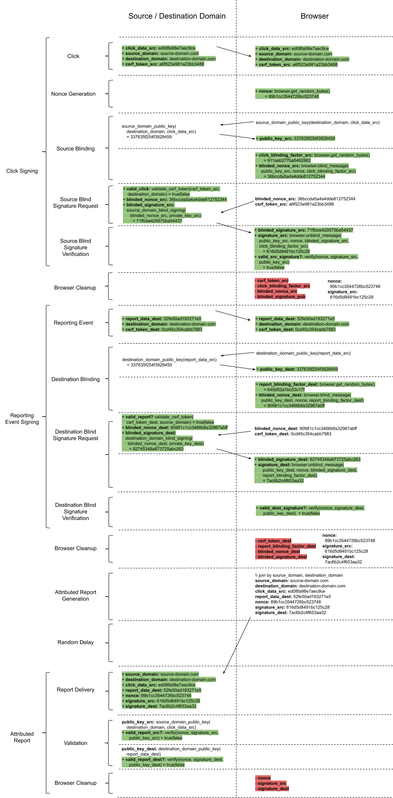

# Fraud Detection in Cross Domain Reporting from a Browser

There are multiple proposals to update how browsers handle and pass information between different domains, with the intent of limiting individual level tracking and increasing user privacy. These solutions rely on the browser to report the result of the cross domain data (often aggregated) directly back to one or both domains.

We outline this proposal (and its prototype) around the action of a cross domain click on *[source-domain.com](http://localhost:5000/source-domain.com/)* to *[destination-domain.com](http://localhost:5000/destination-domain.com/)*. However, our fraud detection strategy will also extend to other actions that result in a user visiting on both domains within some predefined window of time.

Across these proposals, the data which is reported from the browser is generally limited to:

1. **IP-address:** the IP-address of the browser reporting the conversion
2. **domain provided data:**
    1. **source domain data:** limited in entropy and/or obfuscated by added differential noise
    2. **destination domain data:** limited in entropy and/or obfuscated by added differential noise
3. **domain headers:** the pair of eTLD+1 domains to which the report belongs

One serious problem here is that the domain(s) that receive the report likely have no ability to verify its authenticity. These proposals are designed to limit or obfuscate the information, which in turn means that there is not enough information present to differentiate between authentic and inauthentic traffic.

It would be trivially easy to get a botnet to make fraudulent reports. The domain provided data can just be generated randomly, and the fraudster can just send these fraudulent reports with the domain headers set to the domains with which they want to interfere. A few examples of motivation for fraud:

1. Conversion fraud from digital publishers displaying ads within an ad network. These publishers make more money when they drive more conversions, and without a binding between a click and a conversion, publishers can claim fraudulently high conversions.
2. Interfering with a competitor’s reporting data. A competitor to either *[source-domain.com](http://localhost:5000/source-domain.com/) or [destination-domain.com](http://localhost:5000/destination-domain.com/)* could easily send fraudulent reports to *[source-domain.com](http://localhost:5000/source-domain.com/)*, which would be indistinguishable from valid reports. By generating this type of misinformation, one business could limit the ability of a competitor to make informed decisions, and worse, potentially manipulate them into making bad decisions.

# Proposed Solution - High Level

We propose a solution that helps protect against fraudulent reports, without compromising the privacy protecting properties of the proposed browser changes.

This solution leverages [Blind Signatures](https://en.wikipedia.org/wiki/Blind_signature). From the Wikipedia article:

> Blind signatures can also be used to provide *unlinkability*, which prevents the signer from linking the blinded message it signs to a later un-blinded version that it may be called upon to verify.


We employ a construction which we refer to as a partially blind signature. A partially blind signature scheme signs a blinded message and can also bind specific non-blinded information to the signature. It does this by deriving the public key from the non-blinded information. We discuss implementations of this construction in a future section.

Here is the core of how partial blind signatures are used in this proposal:

1. Let’s say the browser has a confidential payload: `A`.
2. We can *blind* it with a `blinding_factor` like this:
    1. `A_blind = blind(A, blinding_factor)`
3. Another entity who does not have the `blinding_factor` in hand cannot tell that `A` and `A_blind` are related, i.e. they cannot they derive `A` from `A_blind` nor `A_blind` from `A`.
4. The browser can send `A_blind` to this entity and ask them to sign it using a public key signing scheme like RSA
5. The browser can also send `A_common` which is non-blinded information, known by both parties. In the context of the proposed browser changes, this would be the *domain provided data*.
6. The entity uses `A_common` to decide how to sign the message. You can think of it as looking up the appropriate public / private key pair based on `A_common`.
    1. `blind_signature = blind_sign(A_blind, private_key)`
7. Once the browser is in possession of the `blind_signature`, it can now *unblind* it using the same `blinding_factor`
    1. `unblinded_signature = unblind(blind_signature, blinding_factor)`
8. The key feature here is that the `unblinded_signature` is a valid RSA signature of `A`, just as if `A` was directly signed using the private RSA key.
9. The browser does not need to trust this entity to perform valid signing operations, it can independently verify they are valid. All that is needed is the public key. This allows the browser to verify that no additional tracking information has been added to the signature.
10. Since the signing operation depends on `A_common`, the browser can look up the corresponding public key meant to be used given `A_common`
    1. `blind_verify(A, signature, public_key) = true|false`
11. Assuming that the signature is valid, the browser can later on send both `A` and `unblinded_signature` to this entity. The entity can also confirm that the signature is valid, using their own public key.
    1. The entity cannot figure out that a specific `A_blind` or `blind_signature` they generated earlier are connected to `A` and `unblind_signature`. This is the key feature of *unlinkability* that is afforded by *blind signatures*. (This assumes they’ve signed at least two different values in the past.)
    2. But sending the entity these values later does prove that at some point in the past, the entity did generate a signature themselves (no-one else can generate such a signature, as they lack the private-key.)

We employ this technique 2 times in the proposal. The browser asks both domain’s websites to generate blind signatures at different stages of the flow. At the end, when the report is delivered back to the domains, we propose including 3 new validation parameters.

1. **Nonce:**
    1. A random string that was generated by the browser.
    2. Unlike a standard cryptographic nonce, it is a *secret* until used in a report and is used as a *join key or commitment* within a report
    3. It has no meaning - and neither the source domain nor destination domain can influence it in any way
    4. As such, it cannot be used to identify the user.
2. **Source Domain Signature**:
    1. The source domain can use their own public key to verify that indeed, this signature is the result of signing *nonce* using their own private key
    2. Neither the source domain nor the destination domain has ever seen either *nonce* or the *Source Domain Signature* before, and cannot influence it in any way, so it can’t be used to identify the user.
3. **Destination Domain Signature**:
    1. Anyone can use the public key of the destination domain to verify that indeed, this signature is the result of signing *nonce* with the destination domain’s private key.
    2. Neither the source domain nor the destination domain has ever seen either *nonce* or the *Destination Domain Signature* before, and cannot influence it in any way, so it can’t be used to identify the user.

# Fraud Prevention Guarantees this solution provides

In this way we are able to contain the amount of reporting fraud in certain ways. It gives us the following guarantees:

1. At the point in time that the source domain receives a click (or other interaction), it was confident enough that it wasn’t talking to a bot / compromised account / professional-link-clicker / etc. that it was willing to generate a signature.
2. At the point in time that the destination domain fired off a reporting event, it was confident enough that it wasn’t talking to a bot / compromised account / professional-link-clicker / etc. that it was willing to generate a signature.
3. We can be reasonably certain that it was the same entity that performed the first action as preformed the reporting event.
4. We can be certain that the link which was clicked led to the destination domain’s website, and that the domain provided data has not been tampered with.
5. There is no risk of a *replay attack*. Each real report will have a unique *nonce* associated with it. The source domain can ignore any duplicate reports with a *nonce* that has been observed before.

# Proposed Solution - Detailed

## Diagram



Let’s walk through the proposed flow step by step:

## Step 1: The link click

We propose adding additional attributes to the anchor tag: `csrf_token_src` and `click_data_src`. Both are just strings, and we do not specify any limitations. For the csrf token there are no limitations and the server can put whatever it wants there.

```
<a href="[click destination URL]"
   csrf_token_src="[any string]"
   click_data_src="[any string]">
```

This csrf token will be passed back to the source domain immediately after a click. It will not be retained in the browser, passed to the destination domain, or otherwise used elsewhere, and as such it cannot be utilized to track cross domain reports.

We propose that upon a link click, the browser stores the following data:

```
{ source_domain,
  destination_domain,
  click_data_src,
  nonce,
  signature_src }
```

for use later at the reporting stage. The following two steps of this proposal expands on the last 2 values: a `nonce` and a `signature_src`.

## Step 2: Nonce Generation

After a cross domain click identified for reporting, the browser generates a random string. Let’s call it `nonce`. This will need to be saved along with the other data as it will be used later at the reporting stage.

This is just a totally random string, and it’s generated by the browser, so it cannot contain tracking information. It should be kept internally within the browser, inaccessible to code that runs on websites, or plugins. It must be retained by the browser until the time at which a report must be generated, as it will be a part of the report payload. It can be discarded after reports are sent out.

## Step 3: Cross Domain Click Signing

This next stage asks the source domain that received the click to certify that a click did indeed happen on their website, and that they trust the entity who generated the click is a legitimate user (i.e. not a bot.)

Receiving a click signing request just tells the source domain: “This user clicked a link”, which the source domain should already know. We assume that source domain has logging about the clicks that occur on their own website. This is first party information necessary to operate the website.

If the click results in a reported action, the browser will eventually send the *nonce* to the source domain (in step 6.)  It cannot send the actual *nonce* to the source domain for signing at this stage, as this would enable the source domain to directly join a report to a specific click, which is likely tied to a specific user. This is where the *blind signing* comes in, allowing the browser to obtain a legitimate signature for *nonce*, without revealing *nonce* to the source domain. This is the *unlinkability* property mentioned earlier.

1. The browser generates a random *blinding factor*. Let’s call it `blinding_factor_src`
2. The browser *blinds* the nonce with the blinding factor:
    `blind(nonce, blinding_factor_src) = blinded_nonce_src`
3. The browser sends the `blinded_nonce_src` to the source domain to request a signature.
    1. We propose utilizing a new *well known* signing endpoint *[source-domain.com/.well-known/blind-signing](http://localhost:5000source-domain.com/.well-known/blind-signing)*
    2. This would be a normal POST request, with cookies. This is so that the source domain can choose to reject the request if the entity is not trusted or appears to be a bot. It is the source domain’s responsibility to employ an effective bot detection strategy, and to only perform a signing operation for trusted, human users (or any other constraints important to reporting.)
    3. The browser would also send the `destination_domain` and `click_data_src` to the endpoint. This would be the public information to the partial blind signature to derive the private and public keys for signing. This is what ensures these values cannot be tampered with by a fraudster.
    4. To ensure that the source domain only generates at most one valid signature per click, and to prevent cross-site request forgery, the browser will also send the `csrf_token_src`. The source domain should refuse to sign more than once per `csrf_token_src`, or for invalid csrf tokens that it did not itself generate for the user making the request.
    5. If all the necessary conditions are met, the source domain should sign the `blinded_nonce_src` it receives using its private key. Let’s call this signature `blinded_signature_src`.
    6. This `blind_signature_src` is returned to the browser.
4. The browser can now *unblind* this signature using the same `blinding_factor_src` used originally to blind the nonce. Let’s call this `real_signature_src`.
    1. `real_signature_src = unblind(blinded_signature_src, blinding_factor_src).`
5. The browser must next verify that this signature is valid, and not being used to send covert tracking data.
    1. We propose utilizing another *well known* endpoint to retrieve the source domain’s public key at *[source-domain.com/.well-known/public-key/<destination_domain>/<click_data_src>](http://localhost:5000/source-domain.com/.well-known/public-key)* and browser downloads the public key using a cookie-less request.
        1. This public-key should be identical for all users for the same `destination_domain` and `click_data_src`, and should change infrequently. To prevent abuse that could be used for tracking, we propose leveraging [public key transparency](https://github.com/google/keytransparency). This would make abuse easily detectable by everyone and need not run on the browser. Bad actors can be identified and dealt with.
    2. Using the source domain’s public key, it can validate the signature:
        1. `verify(nonce, source_domain_signature, source_domain_public_key) = true|false`
6. If the source domain signature is valid, the browser now stores the following 5 values:

```
{ source_domain,
  destination_domain,
  click_data_src,
  nonce,
  domain_signature_src }
```

The browser can (and should) immediately dispose of all of the other values we have discussed including:

* `csrf_token_src`
* `blinding_factor_src`
* `blinded_nonce_src`
* `blinded_signature_src`

It will not need `public_key_src` either for the remainder of this request, and as such could potentially dispose of it, but there’s no harm in caching it for use in future requests.

## Step 4: The Reporting Event

As the destination domain observes user action(s) that should be included in the reporting phase, it will inform the browser of the reporting data, `report_data_dest`. Similar to the `click_data_src`, this data will be limited in entropy and/or obfuscated by added differential noise, but we do not make specific assumptions here.

We propose adding an additional `csrf_token_dest`, as before. This will be generated by the destination domain and is immediately returned back to the destination domain after a reporting event is fired, when the browser asks for a signature to certify the event’s legitimacy. It will not be retained or used elsewhere and as such it cannot be utilized to track across domains.

As is typical of the various proposals, the browser will check to see if there are stored records of clicks leading to this destination domain. If there is such a click, the browser will schedule a randomly delayed POST to the same endpoint, with the specified report.

## Step 5: Reporting Event Signing

This next stage asks the destination domain that fired the reporting event to certify that this event did indeed happen on their website, and that they trust the entity who was interacting with their website is a legitimate user (i.e. not a bot)

Receiving a reporting event signing request just tells the destination domain: “You just fired a reporting event for this user”, which the destination domain should already know. We assume that destination domain has logging about the reporting events that occur on their own website. This is first party information necessary to operate the website.

Since the browser will eventually send the *nonce* to the source domain when it reports an attributed reporting event, it cannot send the actual *nonce* to the destination domain for signing. If the destination domain and source domain eventually share information, this would enable them to link the attributed reporting event to the exact click that was fired on the source domain website - which would uniquely identify the user. This is why we once again employ *blind signing*. As before, this allows the browser to obtain a legitimate signature for *nonce*, without revealing *nonce* to the destination domain.

For each reporting event, the destination domain specifies which source domains and `source_domain_data`  are relevant. The browser will check to see if there are relevant stored clicks from those . For each specified potential pair (or a global subset, such as the most recent or highest priority), the following happens:

1. If there is a click, retrieve from it the *nonce* that was generated at the time of this click. If there is no click, generate a brand new random *nonce*. (We must make a signature request regardless to ensure that the destination domain does not know if there was a matching click or not.)
2. Generate a new random *blinding facto*r. Let’s call it `report_blinding_factor_dest`
3. The browser *blinds* the nonce with the blinding factor:
    1. `blind(nonce, report_blinding_factor_dest) = blinded_nonce_dest`
4. The browser sends the `blinded_nonce_dest` to the destination domain to request a signature:
    1. This will use the same new *well known* signing endpoint: *[destination-domain.com/.well-known/blind-signing](http://localhost//5000:destination-domain.com/.well-known/blind-signing)*
    2. Once again, this would be a normal POST request, with cookies so that the destination domain can choose to reject the request if the entity is not trusted, or appears to be a bot. It is the destination domain’s responsibility to employ an effective bot detection strategy, and to only perform a signing operation for trusted, human users.
    3. This request would additionally contain both the original click `source_domain` as well as the `click_data_src` to be able to find the correct keys to perform the blind signature.
    4. To ensure that the destination domain only generates at most one valid signature per pair reporting event and `source_domain`, and to prevent cross-site request forgery, the browser will also send an unique `csrf_token_dest` (for this specific `source_domain`). The destination domain should refuse to sign more than once per `csrf_token_dest `or for invalid csrf tokens.
    5. If all the necessary conditions are met, the destination domain should sign the `blinded_nonce_dest` it receives using its private key. Let’s call this signature `blinded_signature_dest`
    6. This `blinded_signature_dest` is returned to the browser.
5. Once again, the browser will *unblind* this signature using the same `blinding_factor_dest` used originally to blind the *nonce*. Let’s call this `real_signature_dest`.
    1. `real_signature_dest = unblind(blinded_signature_dest, report_blinding_factor_dest).`
6. The browser will once again verify that this signature is valid, and not being used to send covert tracking data.
    1. The browser will once again utilize the new *well known* endpoint to retrieve the destination domain’s pubic key at *[destination-domain.com/.well-known/public-key/<report_data_dest>](http://destination-domain.com/.well-known/public-key)* and download the public key using a cookie-less request.
        1. As before, this public key should be identical for all users, and should change infrequently. To prevent abuse that could be used for tracking, we propose leveraging [public key transparency](https://github.com/google/keytransparency). This would make abuse easily detectable by everyone and need not run on the browser. Bad actors can be identified and dealt with.
    2. Using the destination domain’s public key, it can validate the signature.
        1. `verify(nonce, real_signature_dest, public_key_dest) = true|false`
7. If the destination domain signature is valid, the browser posts a report back to the source domain (see next section.)

The browser should immediately dispose of:

* `csrf_token_dest`
* `report_blinding_factor_dest`
* `blinded_nonce`
* `blinded_signature_dest`

It will not need `public_key_dest` either for the remainder of this request, and as such could potentially dispose of it, but there’s no harm in caching it for use in future requests.

## Step 6: Report Submission

Once the browser has attributed a reporting event to a click, it will make a click attribution request using an ephemeral session with no cookies, client certificates, etc. This could happen immediately or with some delay, to further prevent user level tracking.

We propose sending 3 additional parameters. As such, this is the new exhaustive list of parameters received by the source domain:

1. IP-address: the IP-address of the device submitting the report
2. `destination_domain`: click destination eTLD+1
3. `click_data_src`: limited in entropy and/or obfuscated by added differential noise
4. `report_data_dest`: limited in entropy and/or obfuscated by added differential noise
5. `nonce`: the random string generated by the browser at click signing. Assumed to be roughly globally unique
6. `signature_src`:  the result of signing the nonce with the source domain’s private key
7. `signature_dest`: the result of signing the nonce with the destination domain’s private key

The source domain can now do a significantly better job differentiating between real reporting events, and fraudulent ones.

* The source domain should validate that the `signature_src` and `signature_dest` are both valid by consulting the public key of each party respectively. It can ignore reports with invalid signatures.
* The source domain can keep a record of every value of *nonce* ever seen before for active signing keys, and ignore reports with previously seen values.


The botnet described earlier is no longer an option for generating fraudulent reports. It could generate random values for *nonce*, but it would be unable to generate a valid *signature* from either domain as it lacks access to either of their private keys. The attacker would have to try to exploit the *[/.well-known/blind-signing]()* of both the source domain and destination domains websites. This would require generating a legitimate looking click on the source domain (without this, the source domain would refuse to sign), as well as generating a legitimate looking reporting event on the destination domain website (without this, the destination domain would refuse to sign). This is a significantly higher barrier to entry. Simple trolls and unsophisticated actors would be unable to overcome these hurdles. Only sophisticated attackers would potentially be able to overcome these obstacles, and even then the scale of the negative impact they can have is inherently limited by their ability to generate legitimate looking clicks and conversions.

At the same time, this proposal does not enable tracking and continues to preserve privacy.

* The source domain has no record of ever having seen either *nonce* or *source domain signature* ever before because they were sent a *blinded nonce*.
    * There is no way of correlating the *nonce* and previously seen *blinded nonce* without the `blinding_factor` the browser used - but that was only kept inside browser in a place inaccessible to client code, and even then only existed for a very limited amount of time.
* The same goes for the destination domain. They will also have no record of seeing *nonce*, or any way of connecting the *blinded nonce* they received earlier with the *nonce* passed back at report time.

# Application to Ad Network Reporting

This proposal might make it feasible to operate an ad network without needing to extend trust to all the publishers on the network.

Under current privacy preserving attribution proposals, conversion reports are ONLY sent back to the publisher where the click happened. As noted above as a motivation for fraud, when an ad is served by a 3rd party ad network, delivering the report directly to the publisher presents a problem. The ad network needs a reliable count of conversions attributed to ads shown on the publisher. It will use this data for many critical purposes, like deciding how much to pay the publisher, and evaluating the efficacy of each publisher on the network.

If the only way for the ad network to obtain the count of conversions attributable to clicks on a given publisher is to ask nicely, this will not work. The publishers will have a strong financial incentive to cheat, and over-report how many conversions in fact occurred. The ad network cannot accept their self reported conversion counts on blind faith.

With this proposal, the publisher can simply forward the raw conversion logs to the ad network. The ad network can verify that the signatures are all valid (both publisher and critically, advertiser signatures), and it can verify that all the values of *nonce* are unique. This might enable the ad network to trust the publisher supplied conversion counts even though it did not directly receive these conversion reports from devices (which is how ad networks currently operate).

While this proposal talks about ad conversions, the anti-fraud mechanism described here could be used for privately sharing more than just counter data with 2 or even more than 2 parties.

# Partial blind signature implementation

A partial blind signature construction could be implemented in several ways. The simplest construction we propose is for the server to have a lookup table of `<destination domain, click_data_src> → (public_key_src, private_key_src)`.
Since the keypair changes for each destination domain and source domain click data, the blind signature is bound to the public information of destination domain and source domain click data. Servers may optimize the storage overhead of the lookup table by employing bucketed tables to group click data and generating the table lazily. Each public key associated with a server would be stored in the key transparency log.
